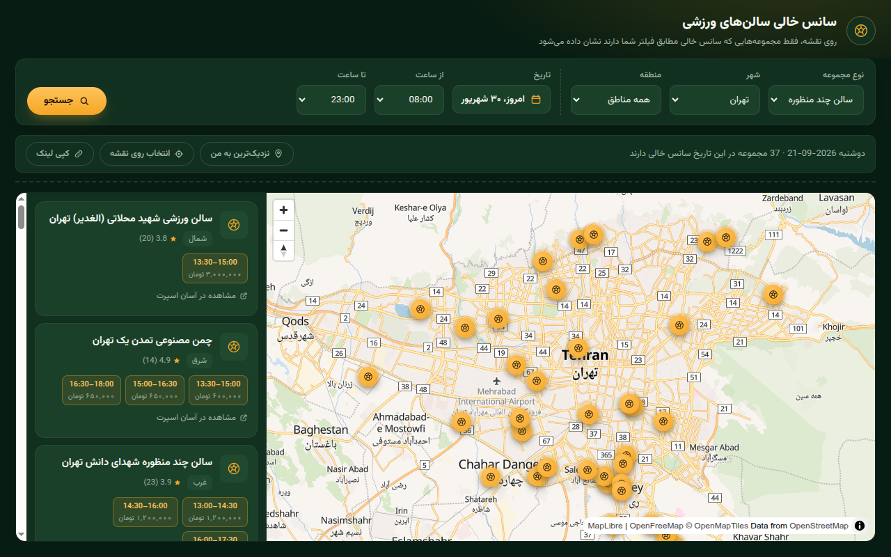

# sans-khali

Find free sports-hall sessions ("سانس خالی") on a map. Pick a city, date and time window and see which futsal halls and turf pitches have an open slot.

**Live demo: https://mheidari98.github.io/sans-khali/**



## Features

- **Map and list**: every venue with a free session matching your filters is a marker on the map and a card in the list. Clicking one highlights the other.
- **Day and time filter**: category (multi-purpose hall or turf), city, district, date, and a from/to time range. The date picker uses the Jalali calendar.
- **Sort by distance**: from your location, or from a pin you drop or drag on the map.
- **Shareable URLs**: the current search is kept in the query string, so a link reproduces it (see below). Your GPS position is never put in a link; a pin you placed by hand is.
- **Zoom stays put**: the first search frames the results, and changing a filter afterwards doesn't zoom out a map you have zoomed in on.

### URL parameters

Values equal to the default are left out, and invalid ones are ignored.

| Param | Meaning | Example |
| --- | --- | --- |
| `c` | category id | `c=2` |
| `s` | city (state) id | `s=2` |
| `r` | district id | `r=112` |
| `d` | date, `yymmdd` (default: today) | `d=260923` |
| `t` | time range as 30-minute slot numbers, `from-to` (`36-44` = 18:00 to 22:00) | `t=36-44` |
| `p` | picked pin, `lat,lng` | `p=35.700,51.400` |

## Run locally

There is no build step.

```sh
python3 -m http.server
```

Then open http://localhost:8000. Any static file server works.

## Tech stack

- Plain HTML, CSS and JavaScript. No framework, no bundler.
- [MapLibre GL JS](https://maplibre.org/) 5.24.0 for the map, loaded from jsDelivr with a pinned version and SRI hash.
- Map style and tiles from [OpenFreeMap](https://openfreemap.org/) (the `bright` style, [OpenMapTiles](https://openmaptiles.org/) schema, data from [OpenStreetMap](https://www.openstreetmap.org/copyright) contributors).
- [`@mapbox/mapbox-gl-rtl-text`](https://github.com/mapbox/mapbox-gl-rtl-text) 0.2.3 so Persian map labels render correctly.
- [Vazirmatn](https://github.com/rastikerdar/vazirmatn) font via Google Fonts.
- Hosted on GitHub Pages.

## Data source

Session data comes from the public API behind [asansports.com](https://asansports.com) (`api.asansports.com/v1`), which the page calls directly from your browser. This project is unofficial and is not affiliated with or endorsed by Asan Sports. Availability and prices are theirs, so use the "view on Asan Sports" link on each venue to book.

## License

[MIT](LICENSE)

---

## فارسی

**سانس خالی سالن‌های ورزشی**: صفحه‌ای ساده که سانس‌های خالی سالن‌های چندمنظوره (فوتسال) و زمین‌های چمن را روی نقشه نشان می‌دهد.

- شهر، منطقه، تاریخ (با تقویم شمسی) و بازهٔ ساعت را انتخاب کنید و فقط سالن‌هایی را ببینید که در آن زمان سانس خالی دارند.
- نتایج را بر اساس فاصله از موقعیت خودتان یا نقطه‌ای که روی نقشه انتخاب می‌کنید مرتب کنید.
- دکمهٔ «کپی لینک» جستجوی فعلی را در یک آدرس ذخیره می‌کند تا برای دوستانتان بفرستید. موقعیت GPS شما هیچ‌وقت در لینک نمی‌آید.
- با عوض کردن فیلترها، نقشه‌ای که زوم کرده‌اید دوباره زوم‌اوت نمی‌شود.

برای اجرا روی سیستم خودتان در پوشهٔ پروژه دستور `python3 -m http.server` را بزنید و آدرس http://localhost:8000 را باز کنید.

داده‌ها از API عمومی [آسان اسپرت](https://asansports.com) گرفته می‌شود. این پروژه غیررسمی است و هیچ وابستگی یا ارتباطی با آسان اسپرت ندارد. برای رزرو، از لینک «مشاهده در آسان اسپرت» روی هر سالن استفاده کنید.
